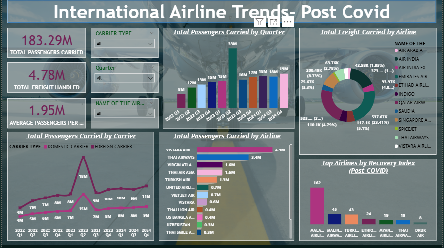

# DGCA Power BI Aviation Recovery Dashboard

This repository contains a Power BI dashboard analyzing **international airline trends post-COVID**, using publicly available data from the **Directorate General of Civil Aviation (DGCA)** and **Ministry of Civil Aviation (MoCA), India**.

---

## 📊 Project Overview

- **Goal**: Analyze post-COVID recovery in Indian aviation
- **Focus**: International airlines, freight, passenger volume
- **Tool**: Microsoft Power BI
- **Data Sources**:
  - DGCA Monthly Traffic Statistics (2022–2024)
  - MoCA Publications

---

## 📈 Key Visuals

- KPI cards: Total passengers, freight handled, average passengers per flight  
- Quarterly trend: Bar chart tracking post-COVID passenger volumes  
- Airline comparison: Line and bar charts by traffic & recovery index  
- Freight distribution: Donut chart per airline

---

## 📄 Full Report

You can view the detailed write-up and analysis in the Word document:  
📎 [View Report (.docx)](DGCA%20Power%20BI%20Dashboard%20Project.docx)

View PowerBi report here: 
📎 [View Report (.pbix)](https://app.powerbi.com/links/f6hHZT_tZG?ctid=aa2e8cd3-d01f-4f96-92ce-1f4dd6e178e7&pbi_source=linkShare&bookmarkGuid=2726d5a0-7c41-4da4-94ba-5b60e71281a2)

---

## 📁 Files in this Repo

| File                        | Description                            |
|-----------------------------|----------------------------------------|
| `DGCA_PowerBI_Project_Lehar.docx` | Detailed project report            |
| `image.png`             | Power BI dashboard image               |
| `README.md`                 | This project summary                   |

---

## 💡 Author

**Lehar Arora**  
*Power BI Developer | Aspiring Data Analyst
📧 lehararora666@gmail.com
